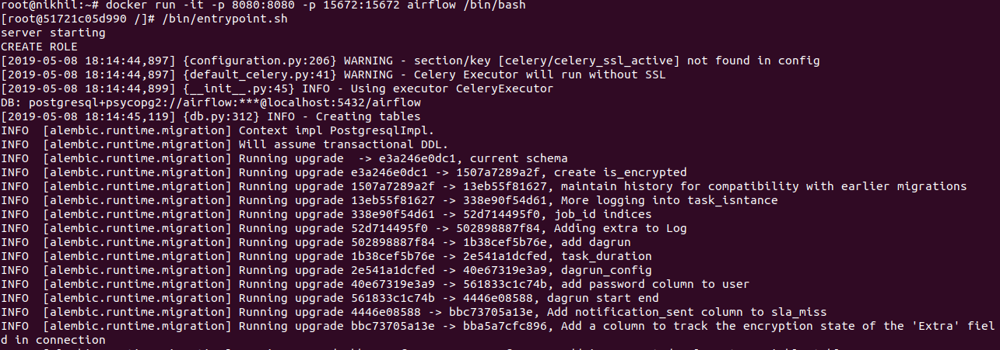
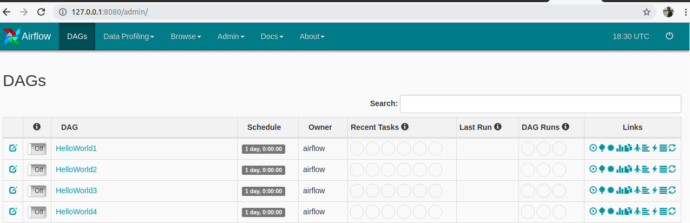
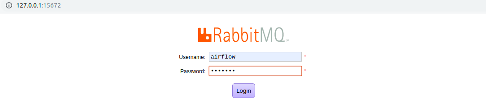
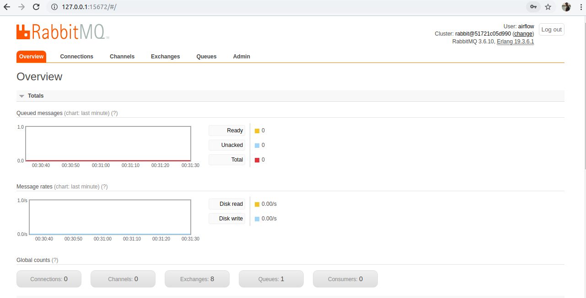

####################################
Airflow with Celery-Rabbitmq-Docker
####################################

In this document we will learn to install ``Apache Airflow`` with the help of Dockerfile.

Prerequisites
--------------

- Docker installed on respective machine
- Understanding of Docker commands 
- Understanding of Linux basics

Dockerfile
------------

Docker can build images automatically by reading the instructions from a Dockerfile. A Dockerfile is a text document that contains all the commands a user could call on the command line to assemble an image. Using docker build users can create an automated build that executes several command-line instructions in succession.

.. code-block:: bash

   # VERSION 1.9.0 
   # AUTHOR: Swapnil  Prabhu 
   # DESCRIPTION:  Airflow  1.9.0 container  with rabbitmq  
 
   FROM docker.io/fedora/apache 
   #FROM docker.io/fedora 
   MAINTAINER swapnil 
 
   # Airflow parameters 
   ARG AIRFLOW_VERSION=1.10.3 
   ARG AIRFLOW_HOME=/usr/local/ 
   ARG SLUGIFY_USES_TEXT_UNIDECODE=yes 
 
   # Define en_US. 
   ENV LANGUAGE en_US.UTF-8 
   ENV LANG en_US.UTF-8 
   ENV LC_ALL en_US.UTF-8 
   ENV LC_CTYPE en_US.UTF-8 
   ENV LC_MESSAGES en_US.UTF-8 
   ENV LC_ALL en_US.UTF-8 
   #ENV PYTHONPATH /opt/anaconda3/lib/python3.7 
   #ENV PATH="/opt/anaconda3/bin:$PATH" 
 
   #RUN rpm -e python  python2-setuptools-25.1.1-1.fc25.noarch python-pip-8.1.2-2.fc25.noarch supervisor-3.2.4-1.fc25.noarch python-         chardet-2.3.0-1.fc25.noarch python2-requests-2.10.0-4.fc25.noarch 
   # install  the kernel support rpms  
   RUN dnf -y  install postgresql-server \ 
       && dnf -y update glibc-common \ 
       && dnf -y reinstall glibc-common \ 
       && dnf -y install gcc \ 
       && dnf -y install python3.x86_64\ 
       && dnf -y install python3-devel python3-pip\ 
        && dnf -y install openssh*\ 
        && dnf -y install tar\ 
        && dnf -y install bzip2\ 
        && dnf -y install passwd*\ 
        && dnf -y install sudo\ 
       && dnf -y install net-tools\ 
      #&& dnf -y install supervisor\ 
       && dnf -y install postgresql.x86_64 \ 
       && dnf -y install postgresql-devel.x86_64 \ 
       && dnf -y install redhat-rpm-config \ 
       && dnf -y install gcc-c++ \ 
       && dnf -y install rabbitmq-server \ 
       && dnf -y install python3-requests \ 
       && dnf -y install procps-ng \ 
       && dnf -y install findutils.x86_64 \ 
       && dnf -y install openssh.x86_64 \ 
       && dnf -y install less \ 
       && dnf -y install mlocate tar telnet git  
 
     
   # Install the airflow required python libraries 
   RUN  useradd -ms /bin/bash -d ${AIRFLOW_HOME} airflow  
   RUN  useradd cuser 
   RUN echo "cuser:c" | chpasswd  
   #COPY ./anaconda3.7.tar.gz /opt 
   #RUN  tar -C /opt -zxvf  /opt/anaconda3.7.tar.gz 
   #RUN  ln -s /opt/anaconda3/bin/python /usr/bin/python 
   RUN  ln -s /usr/bin/python3 /usr/bin/python 
   RUN python -m pip install -U pip setuptools wheel \ 
       && pip install Cython \ 
       && pip install pika\ 
       && pip install psycopg2-binary\ 
      && pip install pytz \ 
       && pip install pyOpenSSL \ 
       && pip install ndg-httpsclient \ 
       && pip install pyasn1 \ 
       && pip install apache-airflow[s3,crypto,celery,postgres,hive,jdbc,snowflake,databricks]==$AIRFLOW_VERSION \ 
       && pip install apache-airflow[rabbitmq] \ 
       && pip install supervisor \ 
       && pip install Jinja2>=2.10.1 \ 
       && pip install Werkzeug>=0.15 \ 
       && pip install flask==1.0.0 
 
 
 
    # Installation and configuration of Postgresql 
   RUN su - postgres -c "/usr/bin/initdb" 
    RUN echo  "host all  all    0.0.0.0/0  md5" >>/var/lib/pgsql/data/pg_hba.conf 
    #RUN  su - postgres -c "/usr/bin/pg_ctl -D /var/lib/pgsql/data -l logfile start" 
    # DB Setup for Airflow and test 
   #RUN sleep 10 
    #RUN su - postgres -c "psql --command \"CREATE USER airflow WITH SUPERUSER PASSWORD 'airflow';\"" 
    # RUN su - postgres -c "createdb -O airflow airflow" 
    #RUN su - airflow -c "airflow initdb" 
    #RUN su - postgres -c " /usr/bin/pg_ctl -D /var/lib/pgsql/data -l logfile stop" 
    # Configurion files. 
   COPY postgresql.ini /etc/supervisord.d/postgreql.ini 
    COPY supervisord.conf  /etc/supervisord.conf 
    COPY rabbitmq.ini /etc/supervisord.d/rabbitmq.ini 
    COPY airflow.ini /etc/supervisord.d/airflow.ini 
    COPY airflow.cfg  /usr/local/airflow/airflow.cfg 
    COPY rabbitmqadmin.py /bin/rabbitmqadmin.py 
    RUN chmod 777 /bin/rabbitmqadmin.py 
    RUN mkdir -p /usr/local/airflow/dags 
    RUN mkdir -p /usr/local/airflow/logs 
    RUN mkdir -p /usr/local/airflow/plugins 
    RUN mkdir -p /var/run/supervisor 
    RUN mkdir -p /var/log/supervisor 
    RUN chown -R airflow.airflow /usr/local/airflow/ 
   # RUN ln -s /opt/anaconda3/bin/airflow  /usr/bin/airflow 
     # RUN ln -s /opt/anaconda3/bin/gunicorn  /usr/bin/gunicorn 
   #RUN ln -s /opt/anaconda3/bin/supervisord  /usr/bin/supervisord 
   # RUN ln -s /opt/anaconda3/bin/supervisorctl  /usr/bin/supervisorctl 
    #RUN mkdir   /usr/bin/anaconda3 
    #RUN  ln -s /opt/anaconda3/bin/ /usr/bin/anaconda3/bin 
    RUN ssh-keygen -A 
    RUN sed  's/UsePAM yes/UsePAM no/g' /etc/ssh/sshd_config 
    RUN echo  "cuser         ALL=(ALL)       NOPASSWD: ALL" >>/etc/sudoers 
   # COPY HelloWorld*.* /usr/local/airflow/dags/ 
    COPY consumer.py /usr/local/airflow/dags/ 
    COPY publisher.py /usr/local/airflow/dags/ 
    COPY messaging_trigger_dag.py  /usr/local/airflow/dags/ 
    COPY activity_dag.py /usr/local/airflow/dags/ 
    COPY impression_dag.py /usr/local/airflow/dags/ 
    COPY click_dag.py /usr/local/airflow/dags/ 
    RUN mkdir /usr/local/airflow/dags/sensors  
    COPY sensors/* /usr/local/airflow/dags/sensors/ 
    # Setup rabbitmq   
 
   #RUN rabbitmq-server & 
   #RUN sleep 10 
   #RUN rabbitmq-plugins enable rabbitmq_web_mqtt rabbitmq_web_mqtt_examples rabbitmq_web_stomp rabbitmq_web_stomp_examples                  rabbitmq_trust_store rabbitmq_top rabbitmq_management_agent rabbitmq_management rabbitmq_jms_topic_exchange rabbitmq_amqp1_0 
   #RUN sleep 5 
   #RUN rabbitmqadmin.py  declare user name=airflow  password=airflow  tags=administrator 
   #RUN rabbitmqadmin.py  declare queue name=airflow 
   #RUN rabbitmqadmin.py  declare permission vhost=/ user=airflow configure=.* write=.* read=.* 
 
   COPY entrypoint.sh /bin/entrypoint.sh 
   RUN chmod 777 /bin/entrypoint.sh 
   RUN chown -R airflow: ${AIRFLOW_HOME} 
   EXPOSE 8080 5555 5432 8793 15670 
 
   #USER airflow 
   #WORKDIR ${AIRFLOW_HOME} 
   CMD "/bin/entrypoint.sh" 

Build Airflow Image
--------------------

- Go to dockerfile location and Run below command

.. code-block:: bash

   $ docker build .
   
- List docker images 

.. code-block:: bash

   $ docker images
   
- Tag docker images with suitable name and List the images again

.. code-block:: bash

   $ docker tag 36a0eeb71983 airflow
   
   $ docker images
   
.. image:: images/dockerimage_new.png
   :width: 300px
   :height: 200px
   :alt: alternate text
   
- Run the airflow image and start the airflow server

.. code-block:: bash
  
   $ docker run -it -p 8080:8080 -p 15672:15672 airflow /bin/bash
   
   $ /bin/entrypoint.sh     #Inside docker container
   

   
- Start airflow server on browser

.. code-block:: command

   http://127.0.0.1:8080/admin/
   

- Login to rabbitmq broker in browser

   

