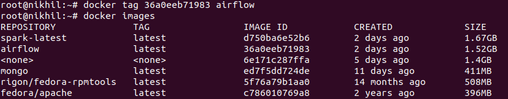

####################################
Airflow with Celery-Rabbitmq-Docker
####################################

.. image:: images/airflow+celery+rabbitmq+docker.png
   :width: 200px
   :height: 100px
   :alt: Alternate text

In this document we will learn to install ``Apache Airflow`` with the help of Dockerfile.

Prerequisites
--------------

- Docker installed on respective machine
- Understanding of Docker commands 
- Understanding of Linux basics

Dockerfile
------------

Docker can build images automatically by reading the instructions from a Dockerfile. A Dockerfile is a text document that contains all the commands a user could call on the command line to assemble an image. Using docker build users can create an automated build that executes several command-line instructions in succession.

.. code-block:: bash

   # VERSION 1.9.0 
   # AUTHOR: Swapnil  Prabhu 
   # DESCRIPTION:  Airflow  1.9.0 container  with rabbitmq  
 
   FROM docker.io/fedora/apache 
   #FROM docker.io/fedora 
   MAINTAINER swapnil 
 
   # Airflow parameters 
   ARG AIRFLOW_VERSION=1.10.3 
   ARG AIRFLOW_HOME=/usr/local/ 
   ARG SLUGIFY_USES_TEXT_UNIDECODE=yes 
 
   # Define en_US. 
   ENV LANGUAGE en_US.UTF-8 
   ENV LANG en_US.UTF-8 
   ENV LC_ALL en_US.UTF-8 
   ENV LC_CTYPE en_US.UTF-8 
   ENV LC_MESSAGES en_US.UTF-8 
   ENV LC_ALL en_US.UTF-8 
   #ENV PYTHONPATH /opt/anaconda3/lib/python3.7 
   #ENV PATH="/opt/anaconda3/bin:$PATH" 
 
   #RUN rpm -e python  python2-setuptools-25.1.1-1.fc25.noarch python-pip-8.1.2-2.fc25.noarch supervisor-3.2.4-1.fc25.noarch python-         chardet-2.3.0-1.fc25.noarch python2-requests-2.10.0-4.fc25.noarch 
   # install  the kernel support rpms  
   RUN dnf -y  install postgresql-server \ 
       && dnf -y update glibc-common \ 
       && dnf -y reinstall glibc-common \ 
       && dnf -y install gcc \ 
       && dnf -y install python3.x86_64\ 
       && dnf -y install python3-devel python3-pip\ 
        && dnf -y install openssh*\ 
        && dnf -y install tar\ 
        && dnf -y install bzip2\ 
        && dnf -y install passwd*\ 
        && dnf -y install sudo\ 
       && dnf -y install net-tools\ 
      #&& dnf -y install supervisor\ 
       && dnf -y install postgresql.x86_64 \ 
       && dnf -y install postgresql-devel.x86_64 \ 
       && dnf -y install redhat-rpm-config \ 
       && dnf -y install gcc-c++ \ 
       && dnf -y install rabbitmq-server \ 
       && dnf -y install python3-requests \ 
       && dnf -y install procps-ng \ 
       && dnf -y install findutils.x86_64 \ 
       && dnf -y install openssh.x86_64 \ 
       && dnf -y install less \ 
       && dnf -y install mlocate tar telnet git  
 
     
   # Install the airflow required python libraries 
   RUN  useradd -ms /bin/bash -d ${AIRFLOW_HOME} airflow  
   RUN  useradd cuser 
   RUN echo "cuser:c" | chpasswd  
   #COPY ./anaconda3.7.tar.gz /opt 
   #RUN  tar -C /opt -zxvf  /opt/anaconda3.7.tar.gz 
   #RUN  ln -s /opt/anaconda3/bin/python /usr/bin/python 
   RUN  ln -s /usr/bin/python3 /usr/bin/python 
   RUN python -m pip install -U pip setuptools wheel \ 
       && pip install Cython \ 
       && pip install pika\ 
       && pip install psycopg2-binary\ 
      && pip install pytz \ 
       && pip install pyOpenSSL \ 
       && pip install ndg-httpsclient \ 
       && pip install pyasn1 \ 
       && pip install apache-airflow[s3,crypto,celery,postgres,hive,jdbc,snowflake,databricks]==$AIRFLOW_VERSION \ 
       && pip install apache-airflow[rabbitmq] \ 
       && pip install supervisor \ 
       && pip install Jinja2>=2.10.1 \ 
       && pip install Werkzeug>=0.15 \ 
       && pip install flask==1.0.0 
 
    # Installation and configuration of Postgresql 
   RUN su - postgres -c "/usr/bin/initdb" 
    RUN echo  "host all  all    0.0.0.0/0  md5" >>/var/lib/pgsql/data/pg_hba.conf 
    #RUN  su - postgres -c "/usr/bin/pg_ctl -D /var/lib/pgsql/data -l logfile start" 
    # DB Setup for Airflow and test 
   #RUN sleep 10 
    #RUN su - postgres -c "psql --command \"CREATE USER airflow WITH SUPERUSER PASSWORD 'airflow';\"" 
    # RUN su - postgres -c "createdb -O airflow airflow" 
    #RUN su - airflow -c "airflow initdb" 
    #RUN su - postgres -c " /usr/bin/pg_ctl -D /var/lib/pgsql/data -l logfile stop" 
    # Configurion files. 
   COPY postgresql.ini /etc/supervisord.d/postgreql.ini 
    COPY supervisord.conf  /etc/supervisord.conf 
    COPY rabbitmq.ini /etc/supervisord.d/rabbitmq.ini 
    COPY airflow.ini /etc/supervisord.d/airflow.ini 
    COPY airflow.cfg  /usr/local/airflow/airflow.cfg 
    COPY rabbitmqadmin.py /bin/rabbitmqadmin.py 
    RUN chmod 777 /bin/rabbitmqadmin.py 
    RUN mkdir -p /usr/local/airflow/dags 
    RUN mkdir -p /usr/local/airflow/logs 
    RUN mkdir -p /usr/local/airflow/plugins 
    RUN mkdir -p /var/run/supervisor 
    RUN mkdir -p /var/log/supervisor 
    RUN chown -R airflow.airflow /usr/local/airflow/ 
   # RUN ln -s /opt/anaconda3/bin/airflow  /usr/bin/airflow 
     # RUN ln -s /opt/anaconda3/bin/gunicorn  /usr/bin/gunicorn 
   #RUN ln -s /opt/anaconda3/bin/supervisord  /usr/bin/supervisord 
   # RUN ln -s /opt/anaconda3/bin/supervisorctl  /usr/bin/supervisorctl 
    #RUN mkdir   /usr/bin/anaconda3 
    #RUN  ln -s /opt/anaconda3/bin/ /usr/bin/anaconda3/bin 
    RUN ssh-keygen -A 
    RUN sed  's/UsePAM yes/UsePAM no/g' /etc/ssh/sshd_config 
    RUN echo  "cuser         ALL=(ALL)       NOPASSWD: ALL" >>/etc/sudoers 
   # COPY HelloWorld*.* /usr/local/airflow/dags/ 
    COPY consumer.py /usr/local/airflow/dags/ 
    COPY publisher.py /usr/local/airflow/dags/ 
    COPY messaging_trigger_dag.py  /usr/local/airflow/dags/ 
    COPY activity_dag.py /usr/local/airflow/dags/ 
    COPY impression_dag.py /usr/local/airflow/dags/ 
    COPY click_dag.py /usr/local/airflow/dags/ 
    RUN mkdir /usr/local/airflow/dags/sensors  
    COPY sensors/* /usr/local/airflow/dags/sensors/ 
    # Setup rabbitmq   
 
   #RUN rabbitmq-server & 
   #RUN sleep 10 
   #RUN rabbitmq-plugins enable rabbitmq_web_mqtt rabbitmq_web_mqtt_examples rabbitmq_web_stomp rabbitmq_web_stomp_examples                  rabbitmq_trust_store rabbitmq_top rabbitmq_management_agent rabbitmq_management rabbitmq_jms_topic_exchange rabbitmq_amqp1_0 
   #RUN sleep 5 
   #RUN rabbitmqadmin.py  declare user name=airflow  password=airflow  tags=administrator 
   #RUN rabbitmqadmin.py  declare queue name=airflow 
   #RUN rabbitmqadmin.py  declare permission vhost=/ user=airflow configure=.* write=.* read=.* 
 
   COPY entrypoint.sh /bin/entrypoint.sh 
   RUN chmod 777 /bin/entrypoint.sh 
   RUN chown -R airflow: ${AIRFLOW_HOME} 
   EXPOSE 8080 5555 5432 8793 15670 
 
   #USER airflow 
   #WORKDIR ${AIRFLOW_HOME} 
   CMD "/bin/entrypoint.sh" 
   
 
 airflow.ini
 -----------
 
 .. code-block:: bash

      [program:airflow-webserver]
      command=su - airflow -c "airflow webserver"
      directory=/usr/local/airflow
      autostart=true
      autorestart=true
      startretries=3
      stderr_logfile=/usr/local/airflow/logs/webserver.err.log
      stdout_logfile=/usr/local/airflow/logs/webserver.log
      user=root

      [program:airflow-sch]
      command=su - airflow -c "airflow scheduler" 
      directory=/usr/local/airflow
      autostart=true
      autorestart=true
      startretries=3
      stderr_logfile=/usr/local/airflow/logs/scheduler.err.log
      stdout_logfile=/usr/local/airflow/logs/scheduler.log
      user=root

      [program:airflow-worker]
      command=su - airflow -c "airflow worker" 
      directory=/usr/local/airflow
      autostart=true
      autorestart=true
      startretries=3
      stderr_logfile=/usr/local/airflow/logs/worker.err.log
      stdout_logfile=/usr/local/airflow/logs/worker.log
      user=root

postgresql.ini
--------------

.. code-block:: bash

      [program:postgresql]
      command=su - postgres -c "postmaster"
      #command=su - postgres -c " /usr/bin/pg_ctl -D /var/lib/pgsql/data -l logfile "
      directory=/var/lib/pgsql/data
      autostart=true
      autorestart=true
      startretries=3
      stderr_logfile=/var/lib/pgsql/data/postgres_error.log
      stdout_logfile=/var/lib/pgsql/data/postgres.log
      user=root

rabbitmq.ini
-------------

.. code-block:: bash

   [program:rabbitmq]
   command=rabbitmq-server
   #command=su - postgres -c " /usr/bin/pg_ctl -D /var/lib/pgsql/data -l logfile "
   directory=/var/lib/pgsql/data
   autostart=true
   autorestart=true
   startretries=3
   stderr_logfile=/usr/local/airflow/rabbitmq_error.log
   stdout_logfile=/usr/local/airflow//rabbbitmq.log
   user=root

supervisord.conf
----------------

.. code-block:: bash

      ; Sample supervisor config file.

      [unix_http_server]
      file=/var/run/supervisor/supervisor.sock   ; (the path to the socket file)
      ;chmod=0700                 ; sockef file mode (default 0700)
      ;chown=nobody:nogroup       ; socket file uid:gid owner
      ;username=user              ; (default is no username (open server))
      ;password=123               ; (default is no password (open server))

      ;[inet_http_server]         ; inet (TCP) server disabled by default
      ;port=127.0.0.1:9001        ; (ip_address:port specifier, *:port for all iface)
      ;username=user              ; (default is no username (open server))
      ;password=123               ; (default is no password (open server))

      [supervisord]
      logfile=/var/log/supervisor/supervisord.log  ; (main log file;default $CWD/supervisord.log)
      logfile_maxbytes=50MB       ; (max main logfile bytes b4 rotation;default 50MB)
      logfile_backups=10          ; (num of main logfile rotation backups;default 10)
      loglevel=info               ; (log level;default info; others: debug,warn,trace)
      pidfile=/var/run/supervisord.pid ; (supervisord pidfile;default supervisord.pid)
      nodaemon=false              ; (start in foreground if true;default false)
      minfds=1024                 ; (min. avail startup file descriptors;default 1024)
      minprocs=200                ; (min. avail process descriptors;default 200)
      ;umask=022                  ; (process file creation umask;default 022)
      ;user=chrism                 ; (default is current user, required if root)
      ;identifier=supervisor       ; (supervisord identifier, default is 'supervisor')
      ;directory=/tmp              ; (default is not to cd during start)
      ;nocleanup=true              ; (don't clean up tempfiles at start;default false)
      ;childlogdir=/tmp            ; ('AUTO' child log dir, default $TEMP)
      ;environment=KEY=value       ; (key value pairs to add to environment)
      ;strip_ansi=false            ; (strip ansi escape codes in logs; def. false)

      ; the below section must remain in the config file for RPC
      ; (supervisorctl/web interface) to work, additional interfaces may be
      ; added by defining them in separate rpcinterface: sections
      [rpcinterface:supervisor]
      supervisor.rpcinterface_factory = supervisor.rpcinterface:make_main_rpcinterface

      [supervisorctl]
      serverurl=unix:///var/run/supervisor/supervisor.sock ; use a unix:// URL  for a unix socket
      ;serverurl=http://127.0.0.1:9001 ; use an http:// url to specify an inet socket
      ;username=chris              ; should be same as http_username if set
      ;password=123                ; should be same as http_password if set
      ;prompt=mysupervisor         ; cmd line prompt (default "supervisor")
      ;history_file=~/.sc_history  ; use readline history if available

      ; The below sample program section shows all possible program subsection values,
      ; create one or more 'real' program: sections to be able to control them under
      ; supervisor.

      ;[program:theprogramname]
      ;command=/bin/cat              ; the program (relative uses PATH, can take args)
      ;process_name=%(program_name)s ; process_name expr (default %(program_name)s)
      ;numprocs=1                    ; number of processes copies to start (def 1)
      ;directory=/tmp                ; directory to cwd to before exec (def no cwd)
      ;umask=022                     ; umask for process (default None)
      ;priority=999                  ; the relative start priority (default 999)
      ;autostart=true                ; start at supervisord start (default: true)
      ;autorestart=true              ; retstart at unexpected quit (default: true)
      ;startsecs=10                  ; number of secs prog must stay running (def. 1)
      ;startretries=3                ; max # of serial start failures (default 3)
      ;exitcodes=0,2                 ; 'expected' exit codes for process (default 0,2)
      ;stopsignal=QUIT               ; signal used to kill process (default TERM)
      ;stopwaitsecs=10               ; max num secs to wait b4 SIGKILL (default 10)
      ;user=chrism                   ; setuid to this UNIX account to run the program
      ;redirect_stderr=true          ; redirect proc stderr to stdout (default false)
      ;stdout_logfile=/a/path        ; stdout log path, NONE for none; default AUTO
      ;stdout_logfile_maxbytes=1MB   ; max # logfile bytes b4 rotation (default 50MB)
      ;stdout_logfile_backups=10     ; # of stdout logfile backups (default 10)
      ;stdout_capture_maxbytes=1MB   ; number of bytes in 'capturemode' (default 0)
      ;stdout_events_enabled=false   ; emit events on stdout writes (default false)
      ;stderr_logfile=/a/path        ; stderr log path, NONE for none; default AUTO
      ;stderr_logfile_maxbytes=1MB   ; max # logfile bytes b4 rotation (default 50MB)
      ;stderr_logfile_backups=10     ; # of stderr logfile backups (default 10)
      ;stderr_capture_maxbytes=1MB   ; number of bytes in 'capturemode' (default 0)
      ;stderr_events_enabled=false   ; emit events on stderr writes (default false)
      ;environment=A=1,B=2           ; process environment additions (def no adds)
      ;serverurl=AUTO                ; override serverurl computation (childutils)

      ; The below sample eventlistener section shows all possible
      ; eventlistener subsection values, create one or more 'real'
      ; eventlistener: sections to be able to handle event notifications
      ; sent by supervisor.

      ;[eventlistener:theeventlistenername]
      ;command=/bin/eventlistener    ; the program (relative uses PATH, can take args)
      ;process_name=%(program_name)s ; process_name expr (default %(program_name)s)
      ;numprocs=1                    ; number of processes copies to start (def 1)
      ;events=EVENT                  ; event notif. types to subscribe to (req'd)
      ;buffer_size=10                ; event buffer queue size (default 10)
      ;directory=/tmp                ; directory to cwd to before exec (def no cwd)
      ;umask=022                     ; umask for process (default None)
      ;priority=-1                   ; the relative start priority (default -1)
      ;autostart=true                ; start at supervisord start (default: true)
      ;autorestart=unexpected        ; restart at unexpected quit (default: unexpected)
      ;startsecs=10                  ; number of secs prog must stay running (def. 1)
      ;startretries=3                ; max # of serial start failures (default 3)
      ;exitcodes=0,2                 ; 'expected' exit codes for process (default 0,2)
      ;stopsignal=QUIT               ; signal used to kill process (default TERM)
      ;stopwaitsecs=10               ; max num secs to wait b4 SIGKILL (default 10)
      ;user=chrism                   ; setuid to this UNIX account to run the program
      ;redirect_stderr=true          ; redirect proc stderr to stdout (default false)
      ;stdout_logfile=/a/path        ; stdout log path, NONE for none; default AUTO
      ;stdout_logfile_maxbytes=1MB   ; max # logfile bytes b4 rotation (default 50MB)
      ;stdout_logfile_backups=10     ; # of stdout logfile backups (default 10)
      ;stdout_events_enabled=false   ; emit events on stdout writes (default false)
      ;stderr_logfile=/a/path        ; stderr log path, NONE for none; default AUTO
      ;stderr_logfile_maxbytes=1MB   ; max # logfile bytes b4 rotation (default 50MB)
      ;stderr_logfile_backups        ; # of stderr logfile backups (default 10)
      ;stderr_events_enabled=false   ; emit events on stderr writes (default false)
      ;environment=A=1,B=2           ; process environment additions
      ;serverurl=AUTO                ; override serverurl computation (childutils)

      ; The below sample group section shows all possible group values,
      ; create one or more 'real' group: sections to create "heterogeneous"
      ; process groups.

      ;[group:thegroupname]
      ;programs=progname1,progname2  ; each refers to 'x' in [program:x] definitions
      ;priority=999                  ; the relative start priority (default 999)

      ; The [include] section can just contain the "files" setting.  This
      ; setting can list multiple files (separated by whitespace or
      ; newlines).  It can also contain wildcards.  The filenames are
      ; interpreted as relative to this file.  Included files *cannot*
      ; include files themselves.

      [include]
      files = supervisord.d/*.ini

entrypoint.sh
-------------

.. code-block:: bash

      su - postgres -c " /usr/bin/pg_ctl -D /var/lib/pgsql/data -l logfile start"
      sleep 10
      su - postgres -c "psql --command \"CREATE USER airflow WITH SUPERUSER PASSWORD 'airflow';\""
      su - postgres -c "createdb -O airflow airflow"
      su - airflow -c "airflow initdb"
      su - postgres -c " /usr/bin/pg_ctl -D /var/lib/pgsql/data -l logfile stop"
      rabbitmq-server&
      sleep 10
      rabbitmq-plugins enable  rabbitmq_web_mqtt rabbitmq_web_mqtt_examples rabbitmq_web_stomp rabbitmq_web_stomp_examples                      rabbitmq_trust_store rabbitmq_top rabbitmq_management_agent rabbitmq_management rabbitmq_jms_topic_exchange rabbitmq_amqp1_0
      sleep 5
      rabbitmqadmin.py  declare user name=airflow  password=airflow  tags=administrator
      rabbitmqadmin.py  declare queue name=airflow
      rabbitmqadmin.py  declare permission vhost=/ user=airflow configure=.* write=.* read=.
      rabbitmqctl stop
      supervisord -c /etc/supervisord.conf
      sleep 5
      supervisorctl status

Build Airflow Image
--------------------

- Go to dockerfile location and Run below command

.. code-block:: bash

   $ docker build .
   
- List docker images 

.. code-block:: bash

   $ docker images
   
- Tag docker images with suitable name and List the images again

.. code-block:: bash

   $ docker tag 36a0eeb71983 airflow
   
   $ docker images
   

   
- Run the airflow image and start the airflow server

.. code-block:: bash
  
   $ docker run -it -p 8080:8080 -p 15672:15672 airflow /bin/bash
   
   $ /bin/entrypoint.sh     #Inside docker container
   
.. image:: images/dockerrun1.png
   :width: 300px
   :height: 200px
   :alt: alternate text
   
- Start airflow server on browser

.. code-block:: command

   http://127.0.0.1:8080/admin/
   

- Login to rabbitmq broker in browser

.. image:: images/rabbitmqlogin.png
   :width: 300px
   :height: 200px
   :alt: alternate text
   
.. image:: images/rabbitmqconsole.png
   :width: 300px
   :height: 200px 
   :alt: alternate text

