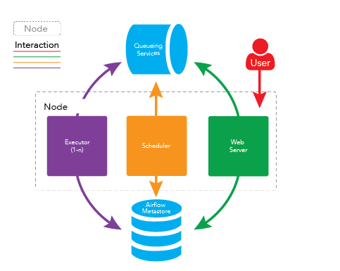
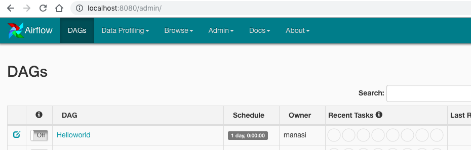
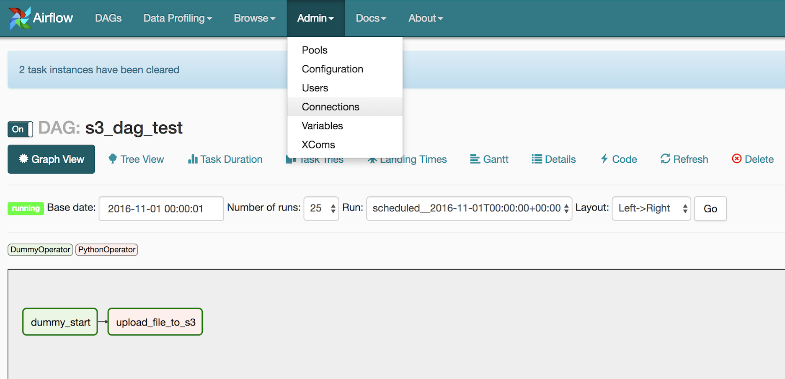
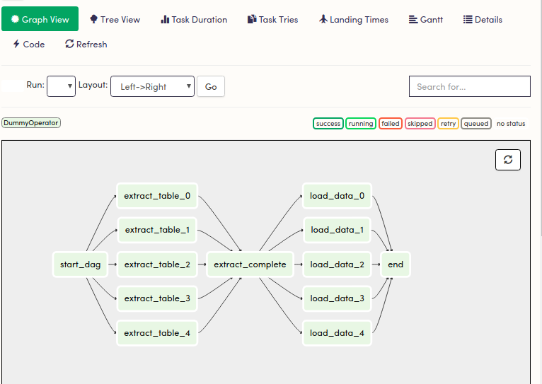
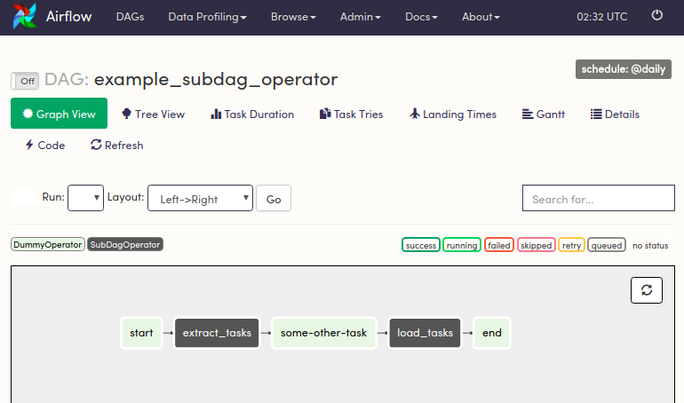
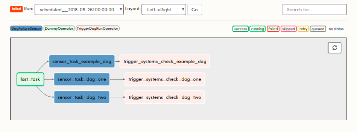

################  
EXELIQ@AIRFLOW  
################

                                  
                            

Apache airflow is a platform for programmatically author schedule and monitor workflows.It is one of the best workflow 
management system.

Airflow was originally developed by Airbnb (Airbnb Engineering) to manage their data based operations with a fast growing data 
set. Airflow is undergoing incubation at Apache Software foundation as Airbnb have decided to open source it under Apache 
certification.

Apache airflow makes your work flow little bit simple and organised by allowing you to divide it into small independent 
(not always) task units. Easy to organise and easy to schedule ones. Your entire workflow can be converted into a DAG (Directed
acyclic graph) with Airflow.

Once your workflows are defined by your code it become more maintainable.With the feature rich user interface your workflow 
pipelines can be easily visualised, monitored and troubleshooted.

Airflow Architecture
-----------------------------

Airflow Component
-------------------------

Webserver
++++++++++

The airflow webserver accepts HTTP requests and allows the user to interact with it. It provides the ability to act on the DAG status (pause, unpause, trigger). When the webserver is started, it starts gunicorn workers to handle different requests in parallel.

Scheduler
++++++++++

The Airflow scheduler monitors DAGs. It triggers the task instances whose dependencies have been met. It monitors and stays in synchronisation with a folder for all DAG objects, and periodically inspects tasks to see if they can be triggered.

Worker
+++++++

Airflow workers are daemons that actually execute the logic of tasks. They manage one to many CeleryD processes to execute the desired tasks of a particular DAG.

Interaction Between Webserver,Scheduler and Worker
++++++++++++++++++++++++++++++++++++++++++++++++++

Airflow daemons don’t need to register with each other and don’t need to know about each other. They all take care of a specific task and when they are all running, everything works as expected. 

The scheduler periodically polls to see if any DAGs which are registered need to be executed. If a specific DAG needs to be triggered, then the scheduler creates a new DagRun instance in the Metastore and starts to trigger the individual tasks in the DAG. The scheduler will do that by pushing messages into the queuing service. A message contains information about the task to execute (DAG_id, task_id..) and what function needs to be performed. 

In some cases, the user will interact with the web server. He can manually trigger a DAG to be ran. A DAGRun is created and the scheduler will start trigger individual tasks the same way as described before. 

Celeryd processes, controlled by workers, periodically pull from the queuing service. When a celeryd process pulls a task message, it updates the task instance in the metastore to a running state and begins executing the code provided. When the task ends (in a success or fail state) it updates the state of the task.

Airflow Concepts
------------------------

The Airflow Platform is a tool for describing, executing, and monitoring workflows.

1) DAG (Directed acyclic graph) 
++++++++++++++++++++++++++++++++

DAG or a Directed Acyclic Graph is a collection of all the tasks you want to run, organized in a way that reflects their 
relationships and dependencies.

At a high level, a DAG can be thought of as a container that holds tasks and their dependencies, and sets the context for when 
and how those tasks should be executed. Each DAG has a set of properties, most important of which are its dag_id, a unique 
identifier amongst all DAGs, its start_date, the point in time at which the DAG’s tasks are to begin executing, and the schedule_interval,
or how often the tasks are to be executed. In addition to the dag_id, start_date, and schedule_interval,each DAG can be 
initialized with a set of default_arguments. These default arguments are inherited by all tasks in the DAG.
DAGs are defined in standard Python files that are placed in Airflow’s DAG_FOLDER. Airflow will execute the code in each file
to dynamically build the DAG objects. You can have as many DAGs as you want,each describing an arbitrary number of tasks.
In general, each one should correspond to a single logical workflow.

EXAMPLE

.. code-block:: python

   from datetime import datetime
   from airflow import DAG
   from airflow.operators.dummy_operator import DummyOperator
   from airflow.operators.python_operator import PythonOperator

   def print_hello():
       return 'Hello world!'

   dag = DAG('hello_world', description='Simple tutorial DAG',
             schedule_interval='0 12 * * *',
             start_date=datetime(2017, 3, 20), catchup=False)

   hello_operator = PythonOperator(task_id='hello_task', python_callable=print_hello, dag=dag)
   

   
2) OPERATORS
+++++++++++++

While DAGs describe how to run a workflow, Operators determine what actually gets done.
An operator describes a single task in a workflow. Operators are usually (but not always) atomic, meaning they can stand on 
their own and don’t need to share resources with any other operators. The DAG will make sure that operators run in the 
correct certain order; other than those dependencies, operators generally run independently. 
In fact, they may run on two completely different machines.

- Airflow provides operators for many common tasks, including:

   - ``BashOperator`` - Excecutes bash commands
   - ``PythonOperator`` - calls an arbitrary Python function
   - ``EmailOperator`` - sends an email
   - ``SimpleHttpOperator`` - sends an HTTP request
   - ``MySqlOperator``, ``SqliteOperator``, ``PostgresOperator``, ``MsSqlOperator``, ``OracleOperator``, ``JdbcOperator`` - executes a SQL command
   - ``sensor`` - Sensor operators keep executing at a time interval and succeed when a criteria is met and fail if and when they time out.
  
.. note:: Operators are only loaded by Airflow if they are assigned to a DAG.
   
Bitshift Composition
'''''''''''''''''''''

Traditionally, operator relationships are set with the set_upstream() and set_downstream() methods. In Airflow 1.8, this can be done with the Python bitshift operators >> and <<. The following four statements are all functionally equivalent:

.. code-block:: bash

   task1 >> task2
   task1.set_downstream(task2)

   task2 << task1
   task2.set_upstream(task1)
   
When using the bitshift to compose operators, the relationship is set in the direction that the bitshift operator points. For example, task1 >> task2 means that task1 runs first and task2 runs second. 

3) Executors
+++++++++++++

Once a DAG is defined (perhaps with the help of an Operator), the following needs to happen in order for a single or set of "tasks" within that DAG to execute and be completed from start to finish:

1. The Metadata Database (in Astronomer, that's PostgreSQL) keeps a record of all tasks within a DAG and their corresponding status (queued, scheduled, running, success, failed, etc) behind the scenes.

2. The Scheduler reads from the Metadatabase to check on the status of each task and decide what needs to get done (and in what order).

This is where the Executor traditionally comes in.

3. The Executor works closely with the Scheduler to figure out what resources will actually complete those tasks (via a worker process or otherwise) as they're queued.

Types of executors
'''''''''''''''''''

- **Local Executor**

The LocalExecutor completes tasks in parallel that run on a single machine (think: your laptop, an EC2 instance, etc.) - the same machine that houses the Scheduler and all code necessary to execute. A single LocalWorker picks up and runs jobs as they’re scheduled and is fully responsible for all task execution.

.. code-block:: text
  
   Pros:

     It's straightforward and easy to set up
     It's cheap and resource light
     It still offers parallelism

   Cons:

     It's not (as) scalable
     It's dependent on a single point of failure

- **Celery Executor**

Celery itself is a way of running python processes in a distributed fashion. To optimize for flexibility and availability, the CeleryExecutor works with a "pool" of independent workers across which it can delegate tasks, via messages. On Celery, your deployment's scheduler adds a message to the queue and the Celery broker delivers it to a Celery worker (perhaps one of many) to execute.

If a worker node is ever down or goes offline, the CeleryExecutor quickly adapts and is able to assign that allocated task or tasks to another worker.

.. code-block:: text
   
   Pros:

     High availability
     Built for horizontal scaling
     Worker Termination Grace Period (on Astronomer)
   
   Cons:

     It's pricier
     It takes some work to set up
     Worker maintenance

- **Sequential Executor**

The Sequential Executor runs a single task instance at a time in a linear fashion with no parallelism functionality (A → B → C). It does identify a single point of failure, making it helpful for debugging. Otherwise, the Sequential Executor is not recommended for any use cases minimally robust that require more than a single task execution at a time.

4) Tasks
+++++++++

Once an operator is instantiated, it is referred to as a “task”. The instantiation defines specific values when calling the abstract operator, and the parameterized task becomes a node in a DAG.

5) Task Instances
++++++++++++++++++

A task instance represents a specific run of a task and is characterized as the combination of a dag, a task, and a point in time. Task instances also have an indicative state, which could be “running”, “success”, “failed”, “skipped”, “up for retry”, etc.

Airflow Workflow
------------------------

- DAG: a description of the order in which work should take place

- Operator: a class that acts as a template for carrying out some work

- Task: a parameterized instance of an operator

- Task Instance: a task that 1) has been assigned to a DAG and 2) has a state associated with a specific run of the DAG

By combining DAGs and Operators to create TaskInstances, you can build complex workflows.

Apache Airflow Additional Functionality
-----------------------------------------

1) Hooks
+++++++++

Hooks are interfaces to external platforms and databases like Hive, S3, MySQL, Postgres, HDFS, and Pig. Hooks implement a common interface when possible, and act as a building block for operators.Hooks keep authentication code and information out of pipelines, centralized in the metadata database.

2) Pools
+++++++++

Some systems can get overwhelmed when too many processes hit them at the same time. Airflow pools can be used to limit the execution parallelism on arbitrary sets of tasks. The list of pools is managed in the UI (Menu -> Admin -> Pools) by giving the pools a name and assigning it a number of worker slots. Tasks can then be associated with one of the existing pools by using the pool parameter when creating tasks (i.e., instantiating operators).

The pool parameter can be used in conjunction with priority_weight to define priorities in the queue, and which tasks get executed first as slots open up in the pool. The default priority_weight is 1, and can be bumped to any number. When sorting the queue to evaluate which task should be executed next, we use the priority_weight, summed up with all of the priority_weight values from tasks downstream from this task.

3) Connections
+++++++++++++++

The connection information to external systems is stored in the Airflow metadata database and managed in the UI (Menu -> Admin -> Connections). A conn_id is defined there and hostname / login / password / schema information attached to it. Airflow pipelines can simply refer to the centrally managed conn_id without having to hard code any of this information anywhere.

4) Queues
++++++++++

When using the CeleryExecutor, the Celery queues that tasks are sent to can be specified. queue is an attribute of BaseOperator, so any task can be assigned to any queue. The default queue for the environment is defined in the airflow.cfg’s celery -> default_queue. This defines the queue that tasks get assigned to when not specified, as well as which queue Airflow workers listen to when started.

Workers can listen to one or multiple queues of tasks. When a worker is started (using the command airflow worker), a set of comma-delimited queue names can be specified (e.g. airflow worker -q spark). This worker will then only pick up tasks wired to the specified queue(s).

5) XComs
++++++++++

A DAG is composed of tasks so the structure of a DAG is defined by how the tasks are connected each other. Setting a downstream or upstream connection between tasks imply only the order with which the tasks are executed.

In order to allow tasks to communicate they can Use the airflow built-in XCom feature.

XCom allow airflow tasks of the same dag to send and receive messages. Since the Airflow workers can be spread out among different machines an in-memory implementation of XCom wouldn't make sense. XCom messages are stored in the airflow database and the Operator developer can use high level function to send and receive messages without the need for explicitly connect to the database.

6) Variables
++++++++++++++

Variables are a generic way to store and retrieve arbitrary content or settings as a simple key value store within Airflow. Variables can be listed, created, updated and deleted from the UI (Admin -> Variables), code or CLI. In addition, json settings files can be bulk uploaded through the UI. 

7) Plugins
+++++++++++

Airflow has a simple plugin manager built-in that can integrate external features to its core by simply dropping files in your $AIRFLOW_HOME/plugins folder.

The python modules in the plugins folder get imported, and hooks, operators, sensors, macros, executors and web views get integrated to Airflow’s main collections and become available for use.

When you write your own plugins, make sure you understand them well. There are some essential properties for each type of plugin. For example,

For ``Operator`` plugin, an execute method is compulsory.

For ``Sensor`` plugin, a poke method returning a Boolean value is compulsory.

- Create your own operator as follow 

.. code-block:: python

   import logging

   from airflow.models import BaseOperator
   from airflow.plugins_manager import AirflowPlugin
   from airflow.utils.decorators import apply_defaults

   log = logging.getLogger(__name__)

   class MyFirstOperator(BaseOperator):

         @apply_defaults
         def __init__(self, my_operator_param, *args, **kwargs):
            self.operator_param = my_operator_param
            super(MyFirstOpe rator, self).__init__(*args, **kwargs)

         def execute(self, context):
            log.info("Hello World!")
            log.info('operator_param: %s', self.operator_param)

  class MyFirstPlugin(AirflowPlugin):
      name = "my_first_plugin"
      operators = [MyFirstOperator]

Branching
----------

Sometimes you need a workflow to branch, or only go down a certain path based on an arbitrary condition which is typically related to something that happened in an upstream task. One way to do this is by using the BranchPythonOperator.

The BranchPythonOperator is much like the PythonOperator except that it expects a python_callable that returns a task_id (or list of task_ids). The task_id returned is followed, and all of the other paths are skipped. The task_id returned by the Python function has to be referencing a task directly downstream from the BranchPythonOperator task.

.. image:: images/airflow-branching.png
   :width: 300px
   :height: 100px
   :alt: alternate text
   
 Sub_Dags
 --------
 
 Most DAGs consist of patterns that often repeat themselves. ETL DAGs that are written to best practice usually all share the pattern of grabbing data from a source, loading it to an intermediary file store or staging table, and then pushing it into production data.

Depending on your set up, using a subdag operator could make your DAG cleaner.

As another example, consider the following DAG:

   
We can combine all of the parallel task-* operators into a single SubDAG, so that the resulting DAG resembles the following:

   
Scheduling and Triggers
------------------------
The Airflow scheduler monitors all tasks and all DAGs to ensure that everything is executed according to schedule. The Airflow scheduler, the heart of the application, "heartbeats" the DAGs folder every couple of seconds to inspect tasks for whether or not they can be triggered.

Key Scheduling Parameters
++++++++++++++++++++++++++

- ``start_date``: This is the execution_date for the first DAG run.

- ``end_date``: The date the DAG should stop running, usually set as none.

- ``execution_timeout``: The maximum time a task should be able to run - the task will fail if it runs for more than this time.

- ``retries``: The number of retries performed before the task fails

- ``retry_delay``: The delay between retries.

Triggers
+++++++++

As workflows are being developed and built upon by different team members, they tend to get more complex.

The first level of complexity can usually be handled by some sort of error messaging - throw an error notification to a particular person or group based on a workflow's failure.

Branching can be helpful for performing conditional logic - execute a set of tasks based off of a condition. For situations where that is not enough - The TriggerDagRunOperator can be used to kick off entire DAGs.

   
DAG Run
++++++++

A DAG Run is an object representing an instantiation of the DAG in time.

Each DAG may or may not have a schedule, which informs how DAG Runs are created. schedule_interval is defined as a DAG arguments, and receives preferably a cron expression as a str, or a datetime.timedelta object. Alternatively, you can also use one of these cron “preset”:

+--------------+----------------------------------------------------------------+---------------+
| preset       |   meaning                                                      |    Cron       |
+--------------+----------------------------------------------------------------+---------------+
| None         |Don’t schedule, use for exclusively “externally triggered” DAGs |               |
+--------------+----------------------------------------------------------------+---------------+
| @once        |Schedule once and only once                                     |               |
+--------------+----------------------------------------------------------------+---------------+
| @hourly      | Run once an hour at the beginning of the hour                  | 0 * * * *     |
+--------------+----------------------------------------------------------------+---------------+
| @daily       | Run once a day at midnight                                     | 0 0 * * *     |
+--------------+----------------------------------------------------------------+---------------+
| @weekly      | Run once a week at midnight on Sunday morning                  | 0 0 * * 0     |
+--------------+----------------------------------------------------------------+---------------+
| @monthly     | Run once a month at midnight of the first day of the month     | 0 0 1 * *     |
+--------------+----------------------------------------------------------------+---------------+
| @yearly      | Run once a year at midnight of January 1                       | 0 0 1 1 *     |
+--------------+----------------------------------------------------------------+---------------+

Security
---------

   
One of the simplest mechanisms for authentication is requiring users to specify a password before logging in. Password authentication requires the used of the password subpackage in your requirements file. Password hashing uses bcrypt before storing passwords.Do changes in ``airflow.cfg``.

.. code-block:: config

   [webserver]
   authenticate = True   
   auth_backend = airflow.contrib.auth.backends.password_auth
   
When password auth is enabled, an initial user credential will need to be created before anyone can login.
